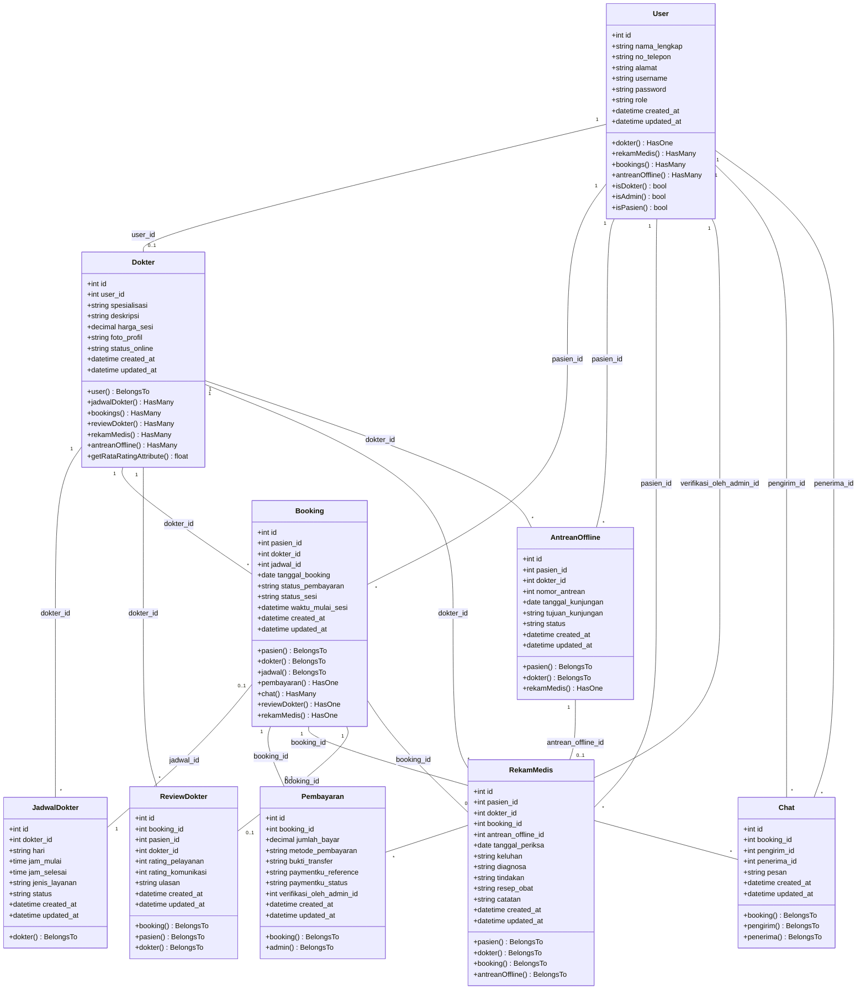

# 🧩 Class Diagram — Sistem Manajemen Klinik Pratama Orinda

## Deskripsi

Class Diagram menggambarkan struktur kelas dalam aplikasi Laravel, termasuk Model Eloquent, atributnya, method-method penting, dan relasi antar model. Diagram ini telah disesuaikan agar sesuai dengan codebase aktual saat ini.

---

## Mermaid Class Diagram (Visual)



---

## Model & Relasi (Detail)

### Model: `User`
```
+-----------------------------------+
|               User                |
+-----------------------------------+
| - id: int                         |
| - nama_lengkap: string            |
| - no_telepon: string (nullable)   |
| - alamat: string (nullable)       |
| - username: string                |
| - password: string                |
| - role: string                    |
+-----------------------------------+
| + dokter(): HasOne                |
| + rekamMedis(): HasMany           |
| + bookings(): HasMany             |
| + antreanOffline(): HasMany       |
| + isAdmin(): bool                 |
| + isDokter(): bool                |
| + isPasien(): bool                |
+-----------------------------------+
```

---

### Model: `Dokter`
```
+-----------------------------------+
|              Dokter               |
+-----------------------------------+
| - id: int                         |
| - user_id: int (FK)               |
| - spesialisasi: string            |
| - deskripsi: string (nullable)    |
| - harga_sesi: decimal             |
| - foto_profil: string             |
| - status_online: string           |
+-----------------------------------+
| + user(): BelongsTo               |
| + jadwalDokter(): HasMany         |
| + bookings(): HasMany             |
| + reviewDokter(): HasMany         |
| + rekamMedis(): HasMany           |
| + antreanOffline(): HasMany       |
| + getRataRatingAttribute(): float |
+-----------------------------------+
```

---

### Model: `JadwalDokter`
```
+-----------------------------------+
|           JadwalDokter            |
+-----------------------------------+
| - id: int                         |
| - dokter_id: int (FK)             |
| - hari: string                    |
| - jam_mulai: time                 |
| - jam_selesai: time               |
| - jenis_layanan: string           |
| - status: string                  |
+-----------------------------------+
| + dokter(): BelongsTo             |
+-----------------------------------+
```

---

### Model: `Booking`
```
+-----------------------------------+
|              Booking              |
+-----------------------------------+
| - id: int                         |
| - pasien_id: int (FK)             |
| - dokter_id: int (FK)             |
| - jadwal_id: int (FK, nullable)   |
| - tanggal_booking: date           |
| - status_pembayaran: string       |
| - status_sesi: string             |
| - waktu_mulai_sesi: datetime      |
+-----------------------------------+
| + pasien(): BelongsTo             |
| + dokter(): BelongsTo             |
| + jadwal(): BelongsTo             |
| + pembayaran(): HasOne            |
| + chat(): HasMany                 |
| + reviewDokter(): HasOne          |
| + rekamMedis(): HasOne            |
+-----------------------------------+
```

---

### Model: `Pembayaran`
```
+-----------------------------------+
|            Pembayaran             |
+-----------------------------------+
| - id: int                         |
| - booking_id: int (FK)            |
| - jumlah_bayar: decimal           |
| - metode_pembayaran: string       |
| - bukti_transfer: string (nullable|
| - paymentku_reference: string     |
| - paymentku_status: string       |
| - verifikasi_oleh_admin_id: int   |
+-----------------------------------+
| + booking(): BelongsTo            |
| + admin(): BelongsTo              |
+-----------------------------------+
```

---

### Model: `AntreanOffline`
```
+-----------------------------------+
|          AntreanOffline           |
+-----------------------------------+
| - id: int                         |
| - pasien_id: int (FK)             |
| - dokter_id: int (FK)             |
| - nomor_antrean: int              |
| - tanggal_kunjungan: date         |
| - tujuan_kunjungan: string        |
| - status: string                  |
+-----------------------------------+
| + pasien(): BelongsTo             |
| + dokter(): BelongsTo             |
| + rekamMedis(): HasOne            |
+-----------------------------------+
```

---

### Model: `Chat`
```
+-----------------------------------+
|               Chat                |
+-----------------------------------+
| - id: int                         |
| - booking_id: int (FK)            |
| - pengirim_id: int (FK)           |
| - penerima_id: int (FK)           |
| - pesan: text                     |
+-----------------------------------+
| + booking(): BelongsTo            |
| + pengirim(): BelongsTo           |
| + penerima(): BelongsTo           |
+-----------------------------------+
```

---

### Model: `ReviewDokter`
```
+-----------------------------------+
|           ReviewDokter            |
+-----------------------------------+
| - id: int                         |
| - booking_id: int (FK)            |
| - pasien_id: int (FK)             |
| - dokter_id: int (FK)             |
| - rating_pelayanan: int           |
| - rating_komunikasi: int          |
| - ulasan: text (nullable)         |
+-----------------------------------+
| + booking(): BelongsTo            |
| + pasien(): BelongsTo             |
| + dokter(): BelongsTo             |
+-----------------------------------+
```

---

### Model: `RekamMedis`
```
+-----------------------------------+
|            RekamMedis             |
+-----------------------------------+
| - id: int                         |
| - pasien_id: int (FK)             |
| - dokter_id: int (FK)             |
| - booking_id: int (FK, nullable)  |
| - antrean_offline_id: int (FK, nul|
| - tanggal_periksa: date           |
| - keluhan: text                   |
| - diagnosa: text                  |
| - tindakan: text                  |
| - resep_obat: text                |
| - catatan: text (nullable)        |
+-----------------------------------+
| + pasien(): BelongsTo             |
| + dokter(): BelongsTo             |
| + booking(): BelongsTo            |
| + antreanOffline(): BelongsTo     |
+-----------------------------------+
```

---

## Controller (Layer Kontrol)

| Controller | Tanggung Jawab |
|---|---|
| `AuthController` | Autentikasi, session, registrasi, logout |
| `PublicController` | Halaman landing page, pencarian dokter, dll |
| `ChatController` | API real-time chat & kirim pesan konsultasi |
| `MidtransWebhookController` | Mengubah status pembayaran berdasarkan callback Midtrans |
| `PaymentkuWebhookController` | Mengubah status pembayaran berdasarkan callback simulator Paymentku |
| `PaymentkuSimulatorController` | Simulator pembayaran mandiri untuk testing lokal |
| **Admin Area:** | |
| `Admin\DashboardController` | Statistik utama dashboard admin |
| `Admin\DokterController` | CRUD dokter spesialis & poli |
| `Admin\JadwalController` | CRUD jadwal praktik mingguan dokter |
| `Admin\PenggunaController` | Manajemen data pasien, dokter, dan admin |
| `Admin\PembayaranController` | Verifikasi manual bukti transfer pembayaran |
| `Admin\AntreanController` | Pengelolaan antrean offline klinik |
| `Admin\LaporanController` | Cetak laporan transaksi & rekam medis |
| `Admin\CrmController` | Analitik CRM (retensi pasien, dll) |
| `Admin\SpkController` | SPK penentuan dokter terbaik metode SAW |
| **Pasien Area:** | |
| `Pasien\DashboardController` | Riwayat konsultasi & antrean pasien |
| `Pasien\BookingController` | Pendaftaran janji temu online |
| `Pasien\AntreanController` | Pendaftaran antrean offline klinik |
| `Pasien\PembayaranController` | Pembayaran via Paymentku (Midtrans Simulator) |
| `Pasien\UlasanController` | Submit review/rating pelayanan & komunikasi dokter |
| `Pasien\RekamMedisController` | Melihat riwayat rekam medis pribadi |
| **Dokter Area:** | |
| `Dokter\DashboardController` | Menampilkan pasien aktif & jadwal hari ini |
| `Dokter\RekamMedisController` | Input diagnosa, resep, keluhan rekam medis pasien |

---

## Middleware

| Middleware | Fungsi |
|---|---|
| `CheckRole` | Memverifikasi role pengguna (`admin`, `dokter`, `pasien`) agar sesuai dengan hak akses route |
| `NoCache` | Menambahkan header HTTP agar halaman dashboard tidak dapat diakses via back button setelah logout |

---

## Relasi Antar Model (Summary)

```
User ─── HasOne ──────► Dokter
User ─── HasMany ─────► Booking (sebagai pasien)
User ─── HasMany ─────► AntreanOffline (sebagai pasien)
User ─── HasMany ─────► RekamMedis (sebagai pasien)
User ─── HasMany ─────► Chat (sebagai pengirim/penerima)
User ─── HasMany ─────► Pembayaran (sebagai admin yang memverifikasi)

Dokter ── HasMany ────► JadwalDokter
Dokter ── HasMany ────► Booking
Dokter ── HasMany ────► ReviewDokter
Dokter ── HasMany ────► RekamMedis
Dokter ── HasMany ────► AntreanOffline

Booking ── HasOne ────► Pembayaran
Booking ── HasOne ────► ReviewDokter
Booking ── HasMany ───► Chat
Booking ── HasOne ────► RekamMedis

AntreanOffline ── HasOne ──► RekamMedis
```
