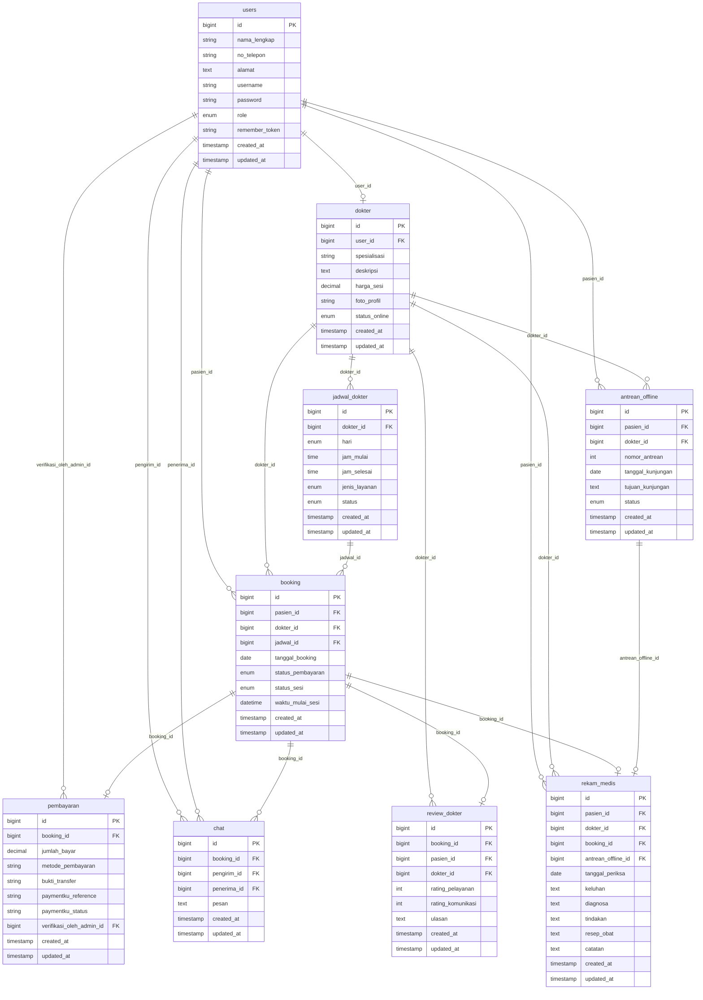

# 🗄️ ERD — Entity Relationship Diagram

## Deskripsi

Entity Relationship Diagram (ERD) menggambarkan struktur database sistem, entitas yang ada, atribut-atributnya (kolom), tipe data, dan relasi antar entitas sesuai dengan skema migrasi database Laravel yang digunakan di sistem saat ini.

---

## Mermaid ERD (Visual)

---

## Daftar Entitas & Atribut

### 1. `users`
| Kolom | Tipe | Keterangan |
|---|---|---|
| `id` | BIGINT (PK) | Primary Key |
| `nama_lengkap` | VARCHAR(100) | Nama lengkap pengguna |
| `no_telepon` | VARCHAR(20) \| Nullable | Nomor telepon/WhatsApp |
| `alamat` | TEXT \| Nullable | Alamat lengkap |
| `username` | VARCHAR(50) (Unique) | Username unik untuk login |
| `password` | VARCHAR(255) | Password terenkripsi |
| `role` | ENUM | `'admin'`, `'dokter'`, `'pasien'` |
| `remember_token` | VARCHAR(100) \| Nullable | Token remember me |
| `created_at` | TIMESTAMP | Waktu pembuatan data |
| `updated_at` | TIMESTAMP | Waktu modifikasi terakhir |

---

### 2. `dokter`
| Kolom | Tipe | Keterangan |
|---|---|---|
| `id` | BIGINT (PK) | Primary Key |
| `user_id` | BIGINT (FK) | Relasi ke `users.id` (Cascade) |
| `spesialisasi` | VARCHAR(100) | Bidang spesialisasi dokter |
| `deskripsi` | TEXT \| Nullable | Deskripsi singkat dokter |
| `harga_sesi` | DECIMAL(10,2) | Biaya konsultasi per sesi |
| `foto_profil` | VARCHAR(255) | Path file foto profil dokter |
| `status_online` | ENUM | `'Online'`, `'Offline'` |
| `created_at` | TIMESTAMP | Waktu pembuatan data |
| `updated_at` | TIMESTAMP | Waktu modifikasi terakhir |

---

### 3. `jadwal_dokter`
| Kolom | Tipe | Keterangan |
|---|---|---|
| `id` | BIGINT (PK) | Primary Key |
| `dokter_id` | BIGINT (FK) | Relasi ke `dokter.id` (Cascade) |
| `hari` | ENUM | `'Senin'`, `'Selasa'`, `'Rabu'`, `'Kamis'`, `'Jumat'`, `'Sabtu'`, `'Minggu'` |
| `jam_mulai` | TIME | Jam mulai praktik |
| `jam_selesai` | TIME | Jam selesai praktik |
| `jenis_layanan` | ENUM | `'Online'`, `'Offline'` |
| `status` | ENUM | `'tersedia'`, `'tidak_tersedia'` |
| `created_at` | TIMESTAMP | Waktu pembuatan data |
| `updated_at` | TIMESTAMP | Waktu modifikasi terakhir |

---

### 4. `booking`
| Kolom | Tipe | Keterangan |
|---|---|---|
| `id` | BIGINT (PK) | Primary Key |
| `pasien_id` | BIGINT (FK) | Relasi ke `users.id` (Cascade) |
| `dokter_id` | BIGINT (FK) | Relasi ke `dokter.id` (Cascade) |
| `jadwal_id` | BIGINT (FK) \| Nullable | Relasi ke `jadwal_dokter.id` (Set Null) |
| `tanggal_booking` | DATE | Tanggal booking sesi konsultasi |
| `status_pembayaran`| ENUM | `'pending'`, `'lunas'`, `'ditolak'` |
| `status_sesi` | ENUM | `'menunggu'`, `'aktif'`, `'selesai'`, `'dibatalkan'` |
| `waktu_mulai_sesi` | DATETIME \| Nullable | Waktu mulai sesi konsultasi aktif |
| `created_at` | TIMESTAMP | Waktu pembuatan data |
| `updated_at` | TIMESTAMP | Waktu modifikasi terakhir |

---

### 5. `pembayaran`
| Kolom | Tipe | Keterangan |
|---|---|---|
| `id` | BIGINT (PK) | Primary Key |
| `booking_id` | BIGINT (FK) | Relasi ke `booking.id` (Cascade) |
| `jumlah_bayar` | DECIMAL(10,2) | Nominal yang harus dibayar |
| `metode_pembayaran`| VARCHAR(50) | Metode bayar (cth: 'Transfer Bank', 'Paymenku') |
| `bukti_transfer` | VARCHAR(255) \| Nullable | Path file bukti transfer manual |
| `paymentku_reference`| VARCHAR(100) \| Nullable | ID/Referensi Transaksi unik Paymenku |
| `paymentku_status` | VARCHAR(50) \| Nullable | Status pembayaran di Paymenku |
| `verifikasi_oleh_admin_id` | BIGINT (FK) \| Nullable | Relasi ke `users.id` (Set Null) |
| `created_at` | TIMESTAMP | Waktu pembayaran diajukan |
| `updated_at` | TIMESTAMP | Waktu verifikasi/update status |

---

### 6. `antrean_offline`
| Kolom | Tipe | Keterangan |
|---|---|---|
| `id` | BIGINT (PK) | Primary Key |
| `pasien_id` | BIGINT (FK) | Relasi ke `users.id` (Cascade) |
| `dokter_id` | BIGINT (FK) | Relasi ke `dokter.id` (Cascade) |
| `nomor_antrean` | INT | Nomor urut antrean offline |
| `tanggal_kunjungan`| DATE | Tanggal kunjungan pasien ke klinik |
| `tujuan_kunjungan` | TEXT \| Nullable | Alasan kunjungan/keluhan awal |
| `status` | ENUM | `'menunggu'`, `'dipanggil'`, `'selesai'`, `'batal'` |
| `created_at` | TIMESTAMP | Waktu pendaftaran antrean |
| `updated_at` | TIMESTAMP | Waktu perubahan status |

---

### 7. `chat`
| Kolom | Tipe | Keterangan |
|---|---|---|
| `id` | BIGINT (PK) | Primary Key |
| `booking_id` | BIGINT (FK) | Relasi ke `booking.id` (Cascade) |
| `pengirim_id` | BIGINT (FK) | Relasi ke `users.id` (Cascade) |
| `penerima_id` | BIGINT (FK) | Relasi ke `users.id` (Cascade) |
| `pesan` | TEXT | Isi chat pesan konsultasi |
| `created_at` | TIMESTAMP | Waktu kirim pesan |
| `updated_at` | TIMESTAMP | |

---

### 8. `review_dokter`
| Kolom | Tipe | Keterangan |
|---|---|---|
| `id` | BIGINT (PK) | Primary Key |
| `booking_id` | BIGINT (FK) (Unique) | Relasi ke `booking.id` (Cascade) |
| `pasien_id` | BIGINT (FK) | Relasi ke `users.id` (Cascade) |
| `dokter_id` | BIGINT (FK) | Relasi ke `dokter.id` (Cascade) |
| `rating_pelayanan` | INT | Rating kepuasan pelayanan medis (1-5) |
| `rating_komunikasi`| INT | Rating keramahan & penjelasan dokter (1-5) |
| `ulasan` | TEXT \| Nullable | Ulasan/komentar tambahan pasien |
| `created_at` | TIMESTAMP | Waktu ulasan disubmit |
| `updated_at` | TIMESTAMP | |

---

### 9. `rekam_medis`
| Kolom | Tipe | Keterangan |
|---|---|---|
| `id` | BIGINT (PK) | Primary Key |
| `pasien_id` | BIGINT (FK) | Relasi ke `users.id` (Cascade) |
| `dokter_id` | BIGINT (FK) | Relasi ke `dokter.id` (Cascade) |
| `booking_id` | BIGINT (FK) \| Nullable | Relasi ke `booking.id` (Cascade - untuk online) |
| `antrean_offline_id`| BIGINT (FK) \| Nullable | Relasi ke `antrean_offline.id` (Cascade - offline) |
| `tanggal_periksa` | DATE | Tanggal pemeriksaan medis |
| `keluhan` | TEXT | Gejala/keluhan yang dialami pasien |
| `diagnosa` | TEXT | Hasil diagnosa dokter |
| `tindakan` | TEXT | Tindakan medis yang dilakukan |
| `resep_obat` | TEXT | Rincian resep obat yang diberikan |
| `catatan` | TEXT \| Nullable | Catatan medis tambahan |
| `created_at` | TIMESTAMP | Waktu pembuatan rekam medis |
| `updated_at` | TIMESTAMP | Waktu modifikasi terakhir |

---

## Relasi Antar Entitas (Kardinalitas)

| Relasi | Tipe Kardinalitas | Penjelasan |
|---|---|---|
| `users` → `dokter` | One-to-One (1:1) | Setiap user ber-role dokter memiliki tepat 1 profil dokter. |
| `users` → `booking` | One-to-Many (1:N) | Pasien (user) dapat melakukan banyak booking sesi online. |
| `users` → `antrean_offline` | One-to-Many (1:N) | Pasien (user) dapat mendaftar banyak antrean offline. |
| `users` → `rekam_medis` | One-to-Many (1:N) | Pasien (user) memiliki riwayat banyak rekam medis. |
| `users` → `pembayaran` (verifikator)| One-to-Many (1:N) | Admin (user) memverifikasi banyak pembayaran manual. |
| `users` → `chat` (pengirim) | One-to-Many (1:N) | User dapat mengirim banyak pesan chat. |
| `users` → `chat` (penerima) | One-to-Many (1:N) | User dapat menerima banyak pesan chat. |
| `dokter` → `jadwal_dokter` | One-to-Many (1:N) | Dokter memiliki beberapa jadwal praktik mingguan. |
| `dokter` → `booking` | One-to-Many (1:N) | Dokter melayani banyak janji temu online. |
| `dokter` → `review_dokter` | One-to-Many (1:N) | Dokter menerima banyak ulasan dari pasien. |
| `dokter` → `rekam_medis` | One-to-Many (1:N) | Dokter membuat banyak catatan rekam medis. |
| `dokter` → `antrean_offline` | One-to-Many (1:N) | Dokter melayani banyak antrean offline di klinik. |
| `booking` → `pembayaran` | One-to-One (1:1) | Setiap booking online terhubung dengan 1 transaksi pembayaran. |
| `booking` → `chat` | One-to-Many (1:N) | Sesi booking online memiliki riwayat ruang percakapan chat. |
| `booking` → `review_dokter` | One-to-One (1:1) | Setiap booking online selesai dapat diulas 1 kali oleh pasien. |
| `booking` → `rekam_medis` | One-to-One (1:1) | Setiap sesi online yang selesai menghasilkan 1 rekam medis. |
| `antrean_offline` → `rekam_medis` | One-to-One (1:1) | Setiap kunjungan offline yang selesai menghasilkan 1 rekam medis. |
| `jadwal_dokter` → `booking` | One-to-Many (1:N) | Sebuah jadwal dokter dapat di-booking oleh beberapa pasien. |
